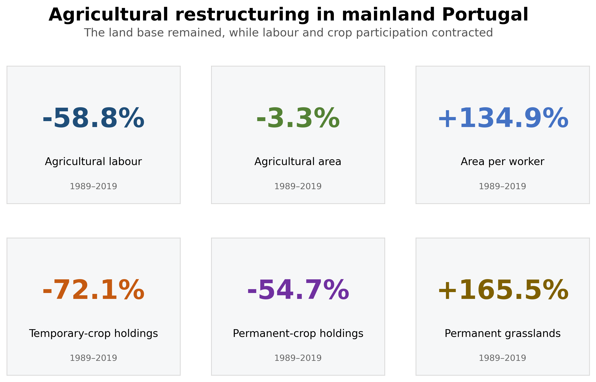
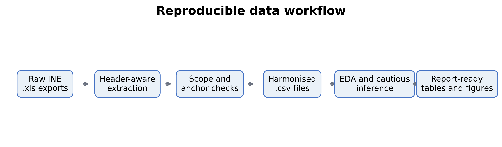
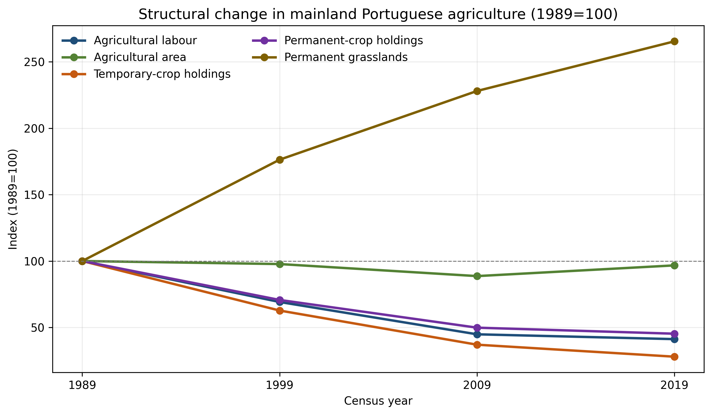
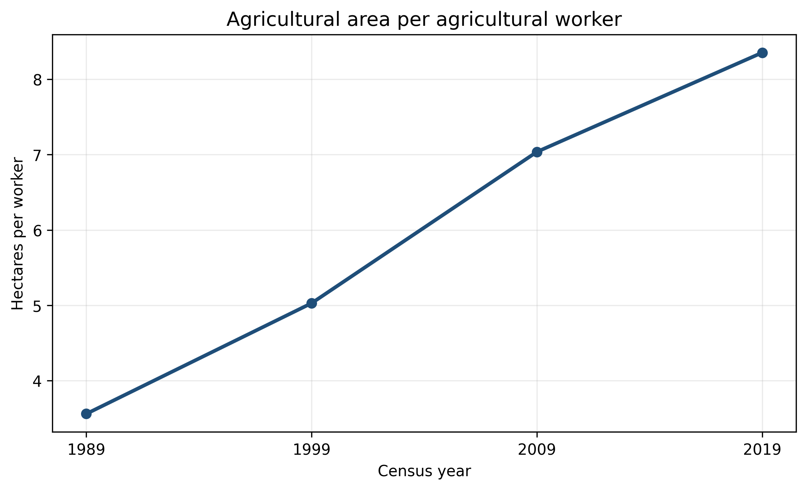
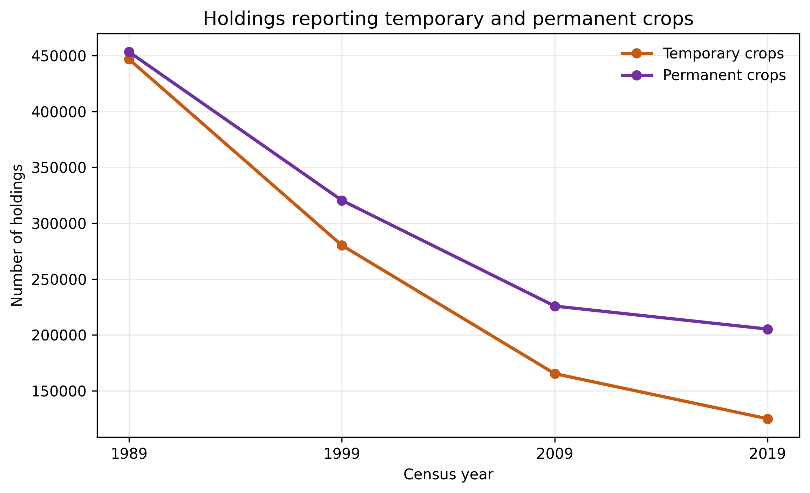
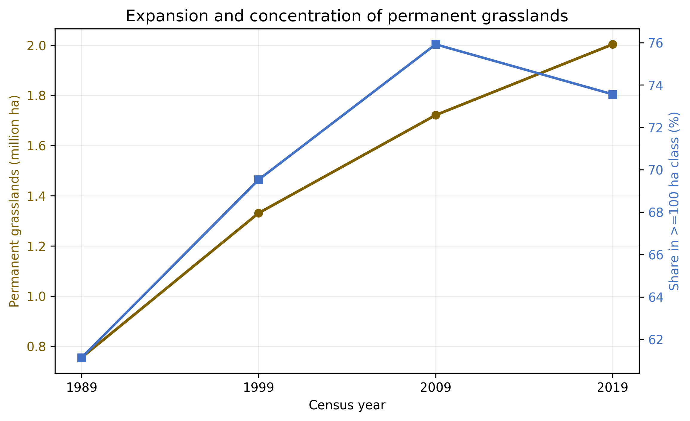
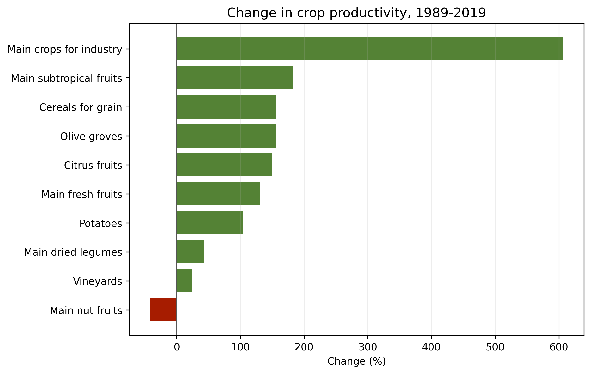

# Agricultural restructuring in mainland Portugal

### Labour, land use, crop systems and productivity, 1989–2019

**Andrea Dombe (27119) · Dandara França (27916) · Fernanda Chácara (26298)**  
Analysis and Visualisation of Complex Agro-Environmental Data · Instituto Superior de Agronomia · 2025/2026

## 1. Introduction

Agricultural change is often described as decline, but that interpretation can hide simultaneous changes in labour, land management and productive systems. A sector can employ fewer people while continuing to manage a similar land area; different crop systems can contract at different rates; and extensive land uses can expand. This report therefore examines agricultural change as a multidimensional restructuring process.

The research question is: **how did the structure of agriculture in mainland Portugal change between 1989 and 2019?** The objective is to distinguish uniform decline from structural reorganisation by jointly analysing agricultural labour, total agricultural area, holdings reporting temporary and permanent crops, permanent grasslands and crop productivity.

Five working hypotheses guide the analysis:

1. **H1:** agricultural labour declined.
2. **H2:** land use changed without a uniform contraction of the agricultural land base.
3. **H3:** temporary- and permanent-crop systems followed different trajectories.
4. **H4:** permanent grasslands became more prominent, particularly in the largest area class.
5. **H5:** productivity evolved differently among crop groups.

The extracts used here contain totals for **Continente** only. The analysis is therefore national and temporal; it does not test regional differences or causal mechanisms.

## 2. Database description and preparation

The project uses six tables downloaded from Statistics Portugal (INE): agricultural labour, agricultural holdings area, holdings with temporary crops, holdings with permanent crops, permanent grasslands by area class and crop productivity. The four common reference years are 1989, 1999, 2009 and 2019.

| Dataset | Unit | Analytical role |
|---|---:|---|
| Agricultural labour | people | Evolution of labour input |
| Agricultural holdings area | ha | Evolution of the agricultural land base |
| Temporary-crop holdings | holdings reporting a crop group | Participation in annual crop systems |
| Permanent-crop holdings | holdings reporting a crop group | Participation in perennial crop systems |
| Permanent grasslands | ha by area class | Expansion and concentration of extensive land use |
| Crop productivity | kg/ha | Differences in productive trajectories |

The preparation is reproducible from the original `.xls` exports. The parser resolves the INE merged headers, selects Continente (code 1), converts `x` and `-` to missing values, translates labels, validates year coverage and performs anchor checks against identifiable source cells. It then creates the harmonised CSV files and a provenance table.

The counts of holdings reporting crop groups are not mutually exclusive: one holding may report more than one crop. They are interpreted as participation indicators and are not summed to estimate a total number of farms. Likewise, total agricultural area divided by crop-reporting holdings is **not** presented as crop-specific average holding size because the required crop-area numerator is unavailable.

## 3. Exploratory data analysis

### 3.1 The central pattern: restructuring rather than disappearance

Between 1989 and 2019, agricultural labour fell by **58.8%**, whereas agricultural area fell by only **3.3%**. Holdings reporting temporary crops declined **72.1%** and those reporting permanent crops declined **54.7%**. In the opposite direction, permanent grasslands expanded **165.5%**. The indicators therefore do not describe one uniform downward movement.

*Figure 1. Evolution of the principal structural indicators, indexed to 1989 = 100. Source: authors’ calculations from INE data.*

### 3.2 A similar land base managed with fewer workers

Agricultural area per worker increased from **3.56 ha** in 1989 to **8.36 ha** in 2019, a rise of **134.9%**. This ratio does not measure average farm size. It indicates that broadly the same land base was associated with substantially fewer agricultural workers. Mechanisation, specialisation and organisational changes are possible explanations, but these data do not establish which mechanism caused the change.

*Figure 2. Agricultural area per agricultural worker. Source: authors’ calculations from INE data.*

### 3.3 Crop participation contracted, especially for temporary crops

Both indicators of crop participation declined, but the reduction was stronger for temporary crops. This supports the proposition that annual and perennial crop systems did not restructure identically. The result concerns the number of holdings reporting each system, not the planted area or production volume.

*Figure 3. Holdings reporting temporary and permanent crops. Categories are not mutually exclusive. Source: authors’ calculations from INE data.*

### 3.4 Permanent grasslands expanded and concentrated

Permanent grasslands increased from **0.75 million ha** to **2.00 million ha**. The share recorded in the class of at least 100 ha increased from **61.1%** to **73.6%**. Expansion was therefore accompanied by a greater concentration of grassland area in the largest size class, consistent with increased importance of extensive land management.

*Figure 4. Permanent grassland area and share in the ≥100 ha class. Source: authors’ calculations from INE data.*

### 3.5 Productivity changes were heterogeneous

Among crop groups with observations in both endpoints, productivity changes ranged from **−41.7%** for main nut fruits to **+606.8%** for main industrial crops. Cereals, olive groves, citrus fruits, potatoes and fresh fruits also recorded sizeable increases. These comparisons are descriptive: missing observations prevent a complete four-year analysis for every crop group, and long-run changes in categories or production composition may affect comparability.

*Figure 5. Percentage change in crop productivity between 1989 and 2019 for groups observed at both endpoints. Source: authors’ calculations from INE data.*

### 3.6 Inferential statistics

Simple OLS trends and Spearman correlations were calculated to complement the descriptive analysis. Each structural series has only four census observations, leaving two residual degrees of freedom. The estimates are consequently sensitive to individual years and should be interpreted as evidence about simple tendencies—not as proof of causality or stable population parameters.

| Indicator | OLS slope per decade | p-value | R² |
|---|---:|---:|---:|
| Agricultural labour | −291,178 | 0.045 | 0.912 |
| Agricultural area | −97,670 ha | 0.506 | 0.244 |
| Holdings with temporary crops | −108,099 | 0.033 | 0.936 |
| Holdings with permanent crops | −83,938 | 0.043 | 0.916 |
| Permanent grasslands | +413,746 ha | 0.013 | 0.975 |
| Agricultural area per worker | +1.64 ha | 0.003 | 0.994 |

The absence of a clear linear trend in total agricultural area, combined with strong tendencies in labour, crop participation and grasslands, reinforces the interpretation of changing structure rather than simple land abandonment.

## 4. Discussion and conclusions

The evidence supports **agricultural restructuring rather than uniform decline**. Labour and crop-participation indicators contracted sharply, yet the total land base changed comparatively little. Consequently, agricultural area per worker more than doubled. Permanent grasslands simultaneously expanded and became more concentrated in the largest area class.

- **H1 is supported:** labour declined substantially, with a negative linear tendency.
- **H2 is partially supported:** total area remained broadly stable, but labour intensity and land-use composition changed strongly.
- **H3 is supported descriptively:** temporary-crop participation contracted more than permanent-crop participation.
- **H4 is supported descriptively:** permanent grasslands expanded and their ≥100 ha class gained weight.
- **H5 is supported descriptively:** productivity trajectories differed widely among crop groups.

The principal limitations are the four census observations, national aggregation, missing productivity values and possible classification changes over three decades. The analysis cannot identify regional disparities or causal mechanisms. A natural extension would retrieve harmonised NUTS-level observations and annual covariates, permitting panel and spatial analyses.

The main take-home message is simple: **mainland Portuguese agriculture managed almost the same total area in 2019 as in 1989, but with far fewer workers and fewer holdings reporting crops, alongside a major expansion of permanent grasslands.** That combination is more accurately described as structural reorganisation than as disappearance.

## 5. References

- Instituto Nacional de Estatística (INE). *Recenseamento agrícola — séries históricas*. Original table exports are preserved under [`data/raw`](../data/raw/).
- Instituto Nacional de Estatística (INE). *Estatísticas agrícolas de base* and *Estatísticas da produção vegetal*. Original table exports are preserved under [`data/raw`](../data/raw/).
- Virtanen, P., et al. (2020). SciPy 1.0: fundamental algorithms for scientific computing in Python. *Nature Methods, 17*, 261–272.

## Annex A. Python code and audit outputs

The complete code appendix is available in the repository:

- [`src/prepare_data.py`](../src/prepare_data.py): extraction, cleaning, translation and validation from the original INE `.xls` files;
- [`src/analysis.py`](../src/analysis.py): descriptive analysis, inference and visualisations;
- [`notebooks/01_data_loading_and_audit.ipynb`](../notebooks/01_data_loading_and_audit.ipynb): executable preparation and audit narrative;
- [`notebooks/02_full_analysis.ipynb`](../notebooks/02_full_analysis.ipynb): executable final analysis;
- [`outputs/tables/data_provenance.csv`](../outputs/tables/data_provenance.csv): source-to-output traceability.
